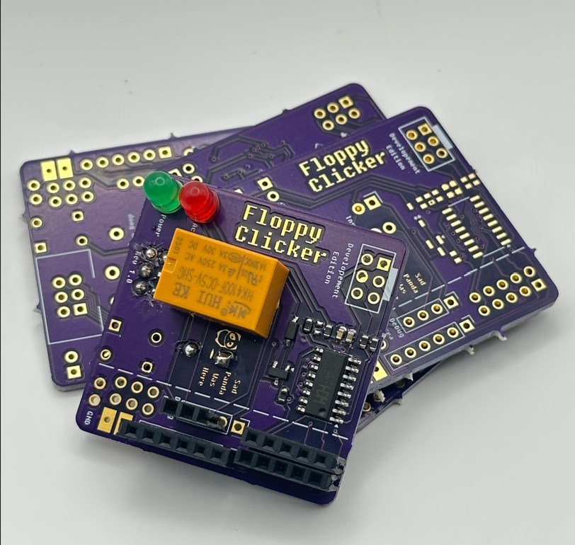

# FloppyClicker SAO

Why not add some retro sound to your badge?  

The Floppy Clicker SAO adds a relay and buzzer that produce retro sounding noises based on i2c traffic and optional i2c commands.  



## Assembly Instructions

Working on a better guide but for now: 
- LED Anode (positive) goes to the circle.
- The speaker should go on the top with the postive facing up towards the MCU.
- The top rectange is the positive for the battery.

## Button Controls

- **Short Press**: Toggle I2C activity sounds on/off
- **Long Press (2s)**: Trigger boot sequence

## I2C Commands

Send commands to register `0x00`:

| Command | Value | Description |
|---------|-------|-------------|
| STOP_ACTIVITY_SOUND | 0x00 | Disable I2C activity sounds |
| START_ACTIVITY_SOUND  | 0x01 | Enable I2C activity sounds |
| STATUS | 0x02 | Request status |
| BOOT_SOUNDS | 0x03 | Trigger boot sequence |
| TRIGGER_PATTERN | 0x04 | Play custom I2C pattern |
| RESET_PATTERN | 0x05 | Reset to default pattern |
| TRIGGER_ADHOC | 0x06 | Play ad-hoc pattern |
| CLEAR_ADHOC | 0x07 | Clear ad-hoc buffer |

## Register Map

| Register | Name | Access | Description |
|----------|------|--------|-------------|
| 0x00 | COMMAND | W | Command register |
| 0x01 | STATUS | R | Sound enabled (0/1) |
| 0x02 | VERSION | R | Firmware version |
| 0x03 | PATTERN_LEN | R/W | Pattern length (0-6) |
| 0x04+ | PATTERN_DATA | R/W | Tone data (4 bytes per tone) |

### Basic Example

```python
from floppy_clicker_control import FloppyClickerController

controller = FloppyClickerController(sda_pin=21, scl_pin=22)

# Enable/disable sounds
controller.start_sound()
controller.stop_sound()

# Trigger boot sequence
controller.trigger_boot_sequence()

# Get firmware version
version = controller.get_version()
```

### Custom Patterns

**I2C Activity Pattern** (6 tones max):
```python
# Set pattern that plays on every I2C transaction
pattern = [(720, 15), (0, 2), (780, 15), (0, 2)]
controller.set_pattern(pattern)
```

**Ad-hoc Pattern** (12 tones max):
```python
# One-off custom sound
r2d2 = [
    (2000, 100), (2500, 100), (1800, 150), (2200, 100),
    (2400, 120), (1900, 80), (2300, 100), (2100, 90)
]
controller.set_adhoc_pattern(r2d2)  # Sets and plays immediately
```

## Pattern Format

Patterns are lists of `(frequency, duration)` tuples:
- **Frequency**: Hz (0 = silence)
- **Duration**: Milliseconds

Example: `[(720, 15), (0, 2), (780, 15)]`
- 720 Hz for 15ms
- Silence for 2ms  
- 780 Hz for 15ms


## Credits

- **I2C Slave Library**: Renze Nicolai
- **CH32V003 Framework**: ch32v003fun

---
