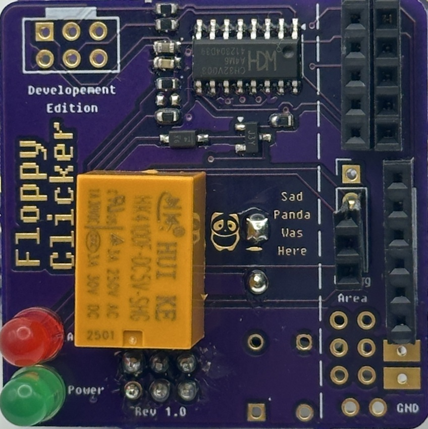

# Revision 1.0

### Bill of Materials:
1. Floppy Clicker Rev 1.0 Board (pre-programmed)
2. 3v Relay (Some debug kits had 5v but were provided with 2 CR2032 batteries)
3. Buzzer/Speaker
4. LEDs
    - 1 Red
    - 1 Green
5. Tactile push button
6. CR2032 battery holder (Double sided sticky tape on back)
7. 2 Wires for battery holder
7. Male SAO connector (2x3 pin header)

### Assembly Notes:
- **Buzzer/Speaker should be mounted on top with positive facing up towards MCU**
  - It was discoverd that the buzzer/speaker did not allow SAO to be securely attached to badges for some badges. (Like the Supercon Communicator Badge)
- LED Anode (positive) goes to the circle pad
- Battery holder top rectangle pad is positive

### Assembly Steps:
1. **Button**:
    - Solder button onto the board (It should only fit one way)

2. **Buzzer**
    - Soldering the buzzer comes next.
    - ⚠️ **Important Notes**
      - The footprint for the Buzzer was also incorrect so it also does not fit well.
      - Another issue discovered is that the speaker causes the SAO to not fit flush with some badges.
      - Both issues can be worked around by using the the legs of one of the LEDs and then cutting them off. Refer to the photos below.
    - **TODO: Insert Photo Here**

3. **LEDs**:
    - Next solder the LEDs
    - ⚠️ **Important**: LED Anode (positive/long leg) goes to the **circle pad**
      - LED Cathode (negative/short leg) goes to the square pad
    - Green LED is for power (Bonus points if you know what computer this is a reference to.)

4. **Relay**
    - Now solder the relay into the board.
    - ⚠️ **Important Notes**
      - This version of the board does not use the correct footprint for the `HK4100F` relay. This means it does not fit well into the provided component holes. 
      - The correct relay to be used for this board is `JRC-21F` or something similar.
      - A `HK4100F` can fit if installed as pictured below.
      - **TODO: Insert Photo Here**

5. **Battery Install**
    - Combine provided wires and 3d printed battery holder with a CR2032 battery.
    - Solder non pin ends of wires to the rectangular pads on the bottom. 
      - The bottom pad is GND.
    - Optional pins can be installed. 
      - *3.2v can be used for powering the SAO independently if desired.*
    - **TODO: Insert Photos Here**

6. **Install SAO Headers**
    - Install the SAO headers provided.

7. **Optional: Install Debug Headers**
    - Headers can be installed in the debug area but, it is intended for use as needed.

### Final Assembly 

