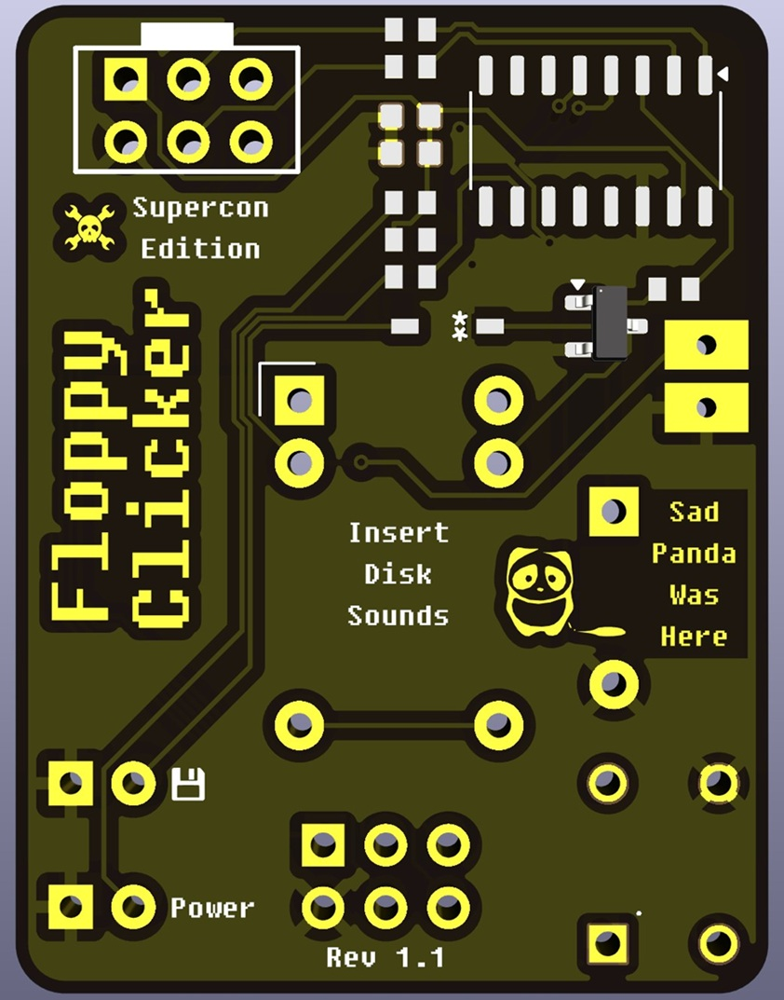
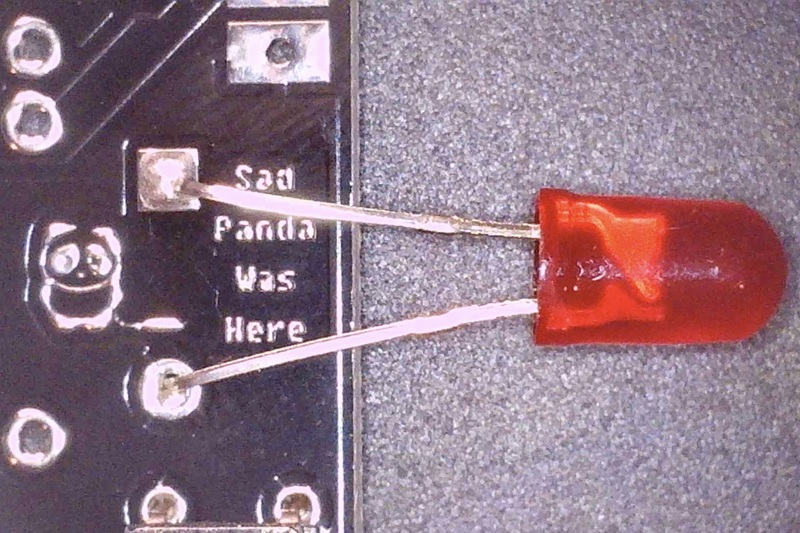
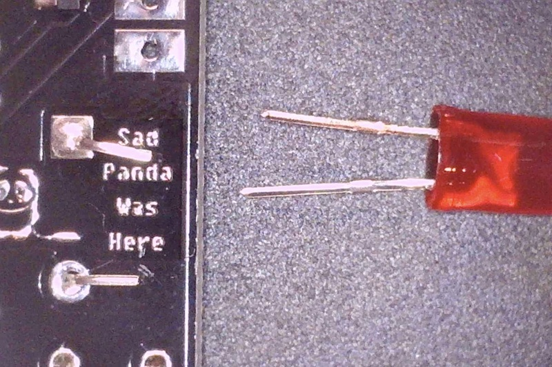

# Revision 1.1

### Bill of Materials:
1. Floppy Clicker Rev 1.1 Board (pre-programmed)
2. 3v Relay
3. Buzzer/Speaker
4. LEDs
    - 1 Red
    - 1 Green
5. Tactile push button
6. CR2032 battery holder (Double sided sticky tape on back)
7. 2 Wires for battery holder
7. Male SAO connector (2x3 pin header)

### Assembly Notes:
- **Buzzer/Speaker should be mounted on side with positive facing up towards MCU**
  - It was discoverd that the buzzer/speaker did not allow SAO to be securely attached to badges for some badges. (Like the Supercon Communicator Badge)
  - Instructions provided for the "bodge" mounting method.
- LED Anode (positive) goes to the circle pad
- Battery holder top rectangle pad is positive

### Assembly Steps:
1. **Button**:
    - Solder button onto the board (It should only fit one way)

2. **Buzzer**
    - Soldering the buzzer comes next.
    - ⚠️ **Important Notes**
      - It was discovered that the buzzer causes the SAO to not fit flush with some badges.
      - The following "bodge" works as a work around for this.
      - Solder an LED to the buzzer pin holes (Red works best since you can test the polarity later with the power led pins.)
      
      - Now cut the LED pins off, leaving enough room for the remaining leads to reach the end of the board.
      
      - Now solder the buzzer to the remains of the leads. Buzzer positive should face upwards towards the MCU and rectangular pads above.
      
    - Credit goes to the person at Supercon who came up with this by using capacitor leads to attach the speaker. Sorry I forgot who it was specifically... 

3. **Install SAO Headers**
    - Install the SAO headers provided.
    - This makes the next part slightly easier (to test).

4. **LEDs**:
    - Next solder the LEDs
    - ⚠️ **Important**: LED Anode (positive/long leg) goes to the **circle pad**
      - LED Cathode (negative/short leg) goes to the square pad.
      - You can test the LED polarity by touching the leads to the power pins while powering the SAO. This may be needed if ypu used the bodge fix for the Buzzer.
    - Green LED is for power (Bonus points if you know what computer this is a reference to.)

5. **Relay**
    - Now solder the relay into the board.
    - It should fix a little snuggly.

6. **Battery Install**
    - Combine provided wires and 3d printed battery holder with a CR2032 battery.
    - Solder non pin ends of wires to the rectangular pads on the bottom. 
      - The bottom pad is GND.
    - Optional pins can be installed. 
      - *3.2v can be used for powering the SAO independently if desired.*
    - Using the doubled sided tape provided, stick the battery holder onto the back of the board.
    - **TODO: Insert Photos Here**