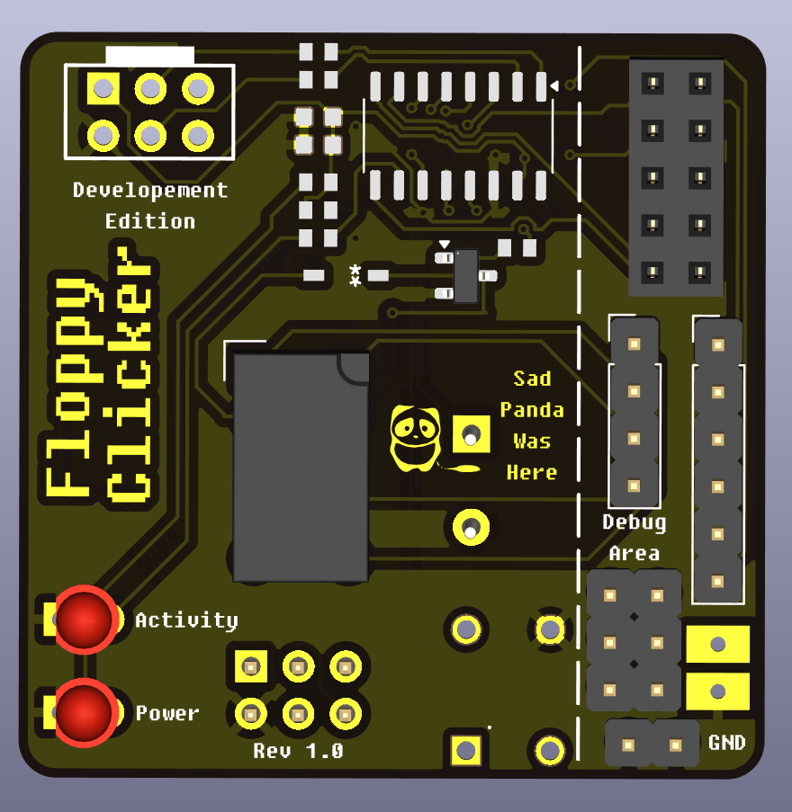
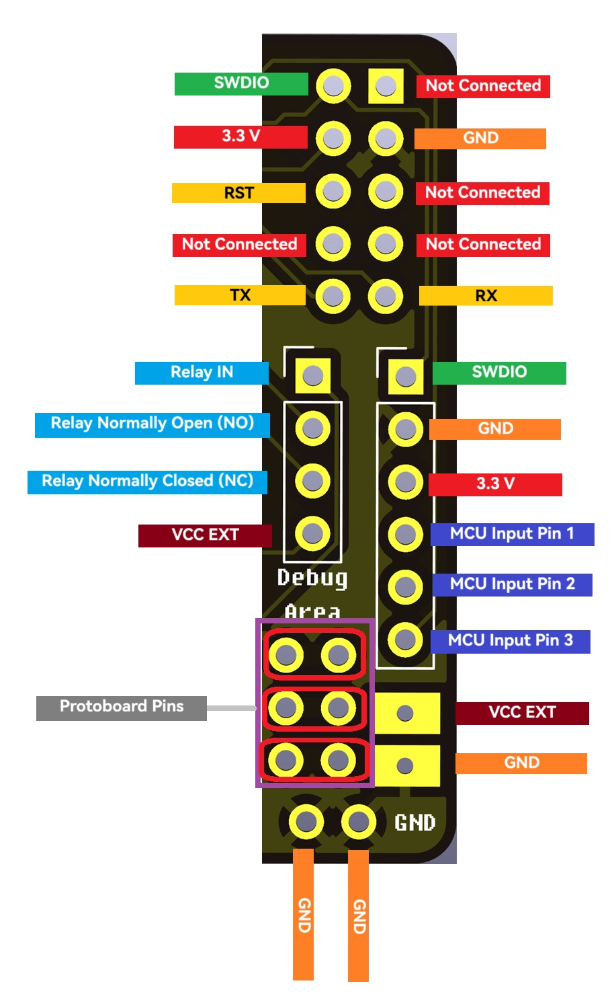

# Revisions and Assembly Instructions

This document tracks the different hardware revisions of the Floppy Clicker SAO design.  
Assembly instructions are linked.

## Revision 1.1 (Supercon Edition)
Slimed down and rushed version for Supercon.  
Fixed footprint issues for Relay and Buzzer but other issues still remain.

*(More Coming Soon)*

## Revision 1.0
First version and POC for many details.

### **Assembly Guide**: [Revision 1.0 Assembly Instructions](assembly_guides/rev-1-0.md)

### **Details**:
- CH32V003 debug pins
- Relay debug pins
- CH32V003 Input Pins
- Proto-board for debugging
- Relay sound POC
- Buzzer sound POC
- I2C interface POC
- Button POC
- 3D Printed CR2032 battery holder POC

### **Known Issues**:
- Silkscreen issues / inconsistencies
- Relay footprint incorrect for intended relay (replacements available)
- Buzzer footprint incorrect
- Diode footprint incorrect
- Can not be programmed with SAO Header

### **Debug Pinout**

### Debug Pin Notes
- Proto-board pins are connect horizontally
- VCC EXT depends on your Relay voltage and does not connect to the MCU
- With the bodge to get the incorrect sized relay slotted, Relay IN is not connected.
  - If you have the correct sized relay, this is not an issue.
- MCU Input Pins 1-3 do not do anything in stock firmware. Was used for testing.

## Change Log

### 2025-11-04
- Documented Rev 1.1 specifications
- Added Rev 1.0 assembly

### 2025-11-03
- Created revision document
- Documented Rev 1.0 specifications

## Notes for New Revisions

When creating new revisions, please update this document with:
- Revisions version number
- List of changes from previous version
- Known issues (if any)
- Assembly notes specific to that revision
- High-quality board images

---

*For firmware documentation, see [README.md](../README.md)*

